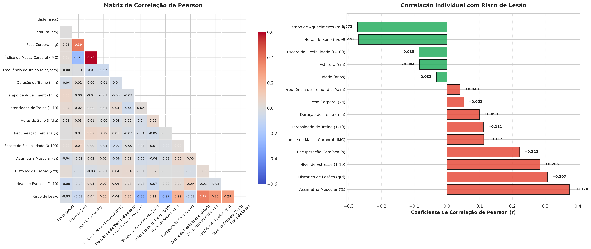
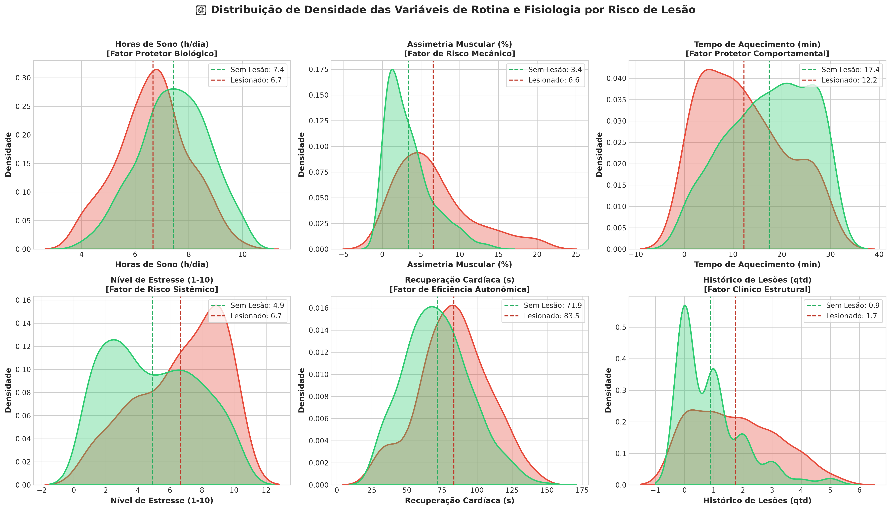
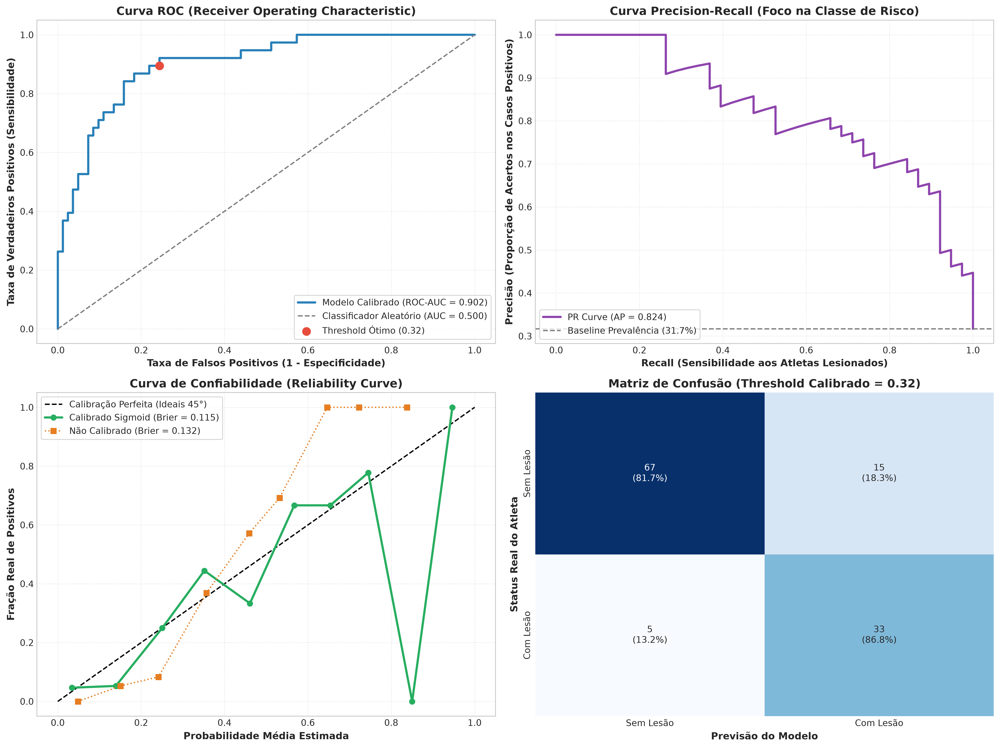
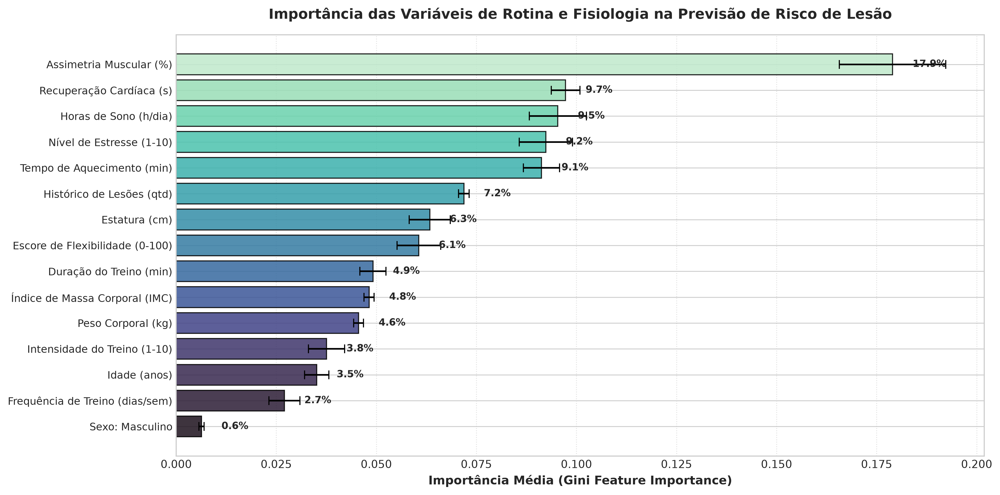
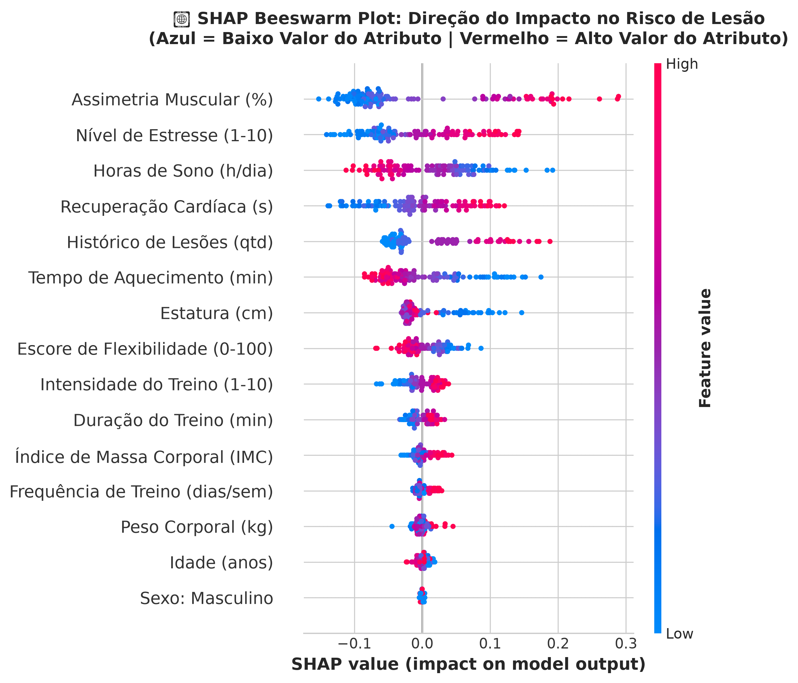
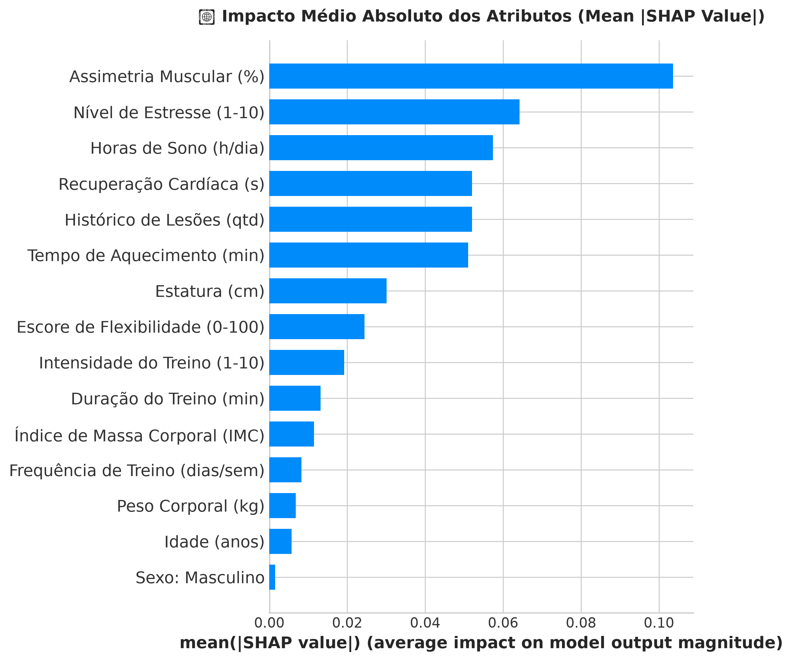

# 🏃‍♂️ Estudo Exploratório de Correlações e Indicadores de Risco de Lesão Esportiva (SIRP-600)

[](https://www.python.org/)
[](https://scikit-learn.org/)
[](https://shap.readthedocs.io/)
[](#sobre-o-dataset-sirp-600)
[](#ressalvas-e-limitações-metodológicas)

Este repositório contém uma investigação analítica detalhada sobre as relações estatísticas entre **variáveis comportamentais de rotina, biométricas e mecânicas funcionais** e a ocorrência de lesões musculoesqueléticas, utilizando a base de dados **SIRP-600** (*Sports Injury Risk Prediction*).

> [!WARNING]
> ### ⚠️ Nota Fundamental de Escopo e Limitação Científica
> **Este estudo possui finalidade estritamente exploratória e analítica.**
> 
> As análises, métricas probabilísticas e pesos obtidos refletem **correlações estatísticas e associações de padrões no conjunto de dados analisado**. 
> **ESTE MODELO NÃO DEVE SER UTILIZADO COMO SISTEMA PREDITIVO EM PRODUÇÃO OU PARA TOMADA DE DECISÃO CLÍNICA/MÉDICA.** 
> Correlação estatística **não implica relação de causalidade direta**. A transição de um estudo observacional para uma ferramenta de predição diagnóstica exigiria ensaios clínicos prospectivos, validação em coortes longitudinais reais e acompanhamento médico individualizado.

---

## 📋 Sumário
1. [Sobre o Dataset SIRP-600](#sobre-o-dataset-sirp-600)
2. [Cruzamento de Dados e Análise de Correlações (EDA)](#cruzamento-de-dados-e-análise-de-correlações-eda)
3. [Distribuição de Densidade por Histórico de Lesão](#distribuição-de-densidade-por-histórico-de-lesão)
4. [Metodologia de Modelagem e Avaliação Probabilística](#metodologia-de-modelagem-e-avaliação-probabilística)
5. [O que Cada Métrica Significa e Resultados Obtidos](#o-que-cada-métrica-significa-e-resultados-obtidos)
6. [Pesos das Variáveis e Interpretabilidade com SHAP](#pesos-das-variáveis-e-interpretabilidade-com-shap)
7. [Estratificação Teórica de Risco](#estratificação-teórica-de-risco)
8. [Ressalvas e Limitações Metodológicas](#ressalvas-e-limitações-metodológicas)
9. [Estrutura do Repositório e Como Executar](#estrutura-do-repositório-e-como-executar)

---

## 🗃️ Sobre o Dataset SIRP-600

O **SIRP-600** é composto por **600 amostras individuais de atletas** (335 mulheres e 265 homens), com faixa etária entre 18 e 40 anos, sem valores ausentes (*ML-Ready*), registrando 15 variáveis independentes e uma variável alvo de desfecho:

* **Variável Alvo (`Injury_Risk`):** 
  * `0`: Não lesionado / Controle saudável (68.5% — 411 atletas).
  * `1`: Lesão ocorrida (31.5% — 189 atletas).
* **Dimensões Físicas e Demográficas:** Idade, Sexo, Estatura (cm), Peso Corporal (kg) e Índice de Massa Corporal (IMC).
* **Rotina e Treinamento:** Frequência Semanal (dias/sem), Duração da Sessão (min), Tempo de Aquecimento (min) e Intensidade Subjetiva de Esforço (1-10).
* **Fisiologia e Recuperação:** Horas Médias de Sono (h/dia), Tempo de Recuperação da Frequência Cardíaca (s), Escore de Flexibilidade (0-100) e Assimetria Muscular Contralateral (%).
* **Fatores Clínicos e Emocionais:** Histórico de Lesões Anteriores (qtd) e Nível de Estresse Psicológico (1-10).

---

## 📈 Cruzamento de Dados e Análise de Correlações (EDA)

Para avaliar como cada atributo se relaciona com o desfecho de lesão, foram calculados os coeficientes de **correlação linear de Pearson ($r$)** e **monotônica de Spearman ($\rho$)**.



#### 🔍 O que esta imagem representa e o que as métricas demonstram:
* **Estrutura Visual:** A figura é dividida em dois painéis analíticos:
  * **Painel Esquerdo (Heatmap Triangular):** Apresenta os coeficientes de correlação linear de Pearson entre todos os pares de variáveis numéricas. As células com tons avermelhados indicam correlação positiva, azuladas indicam correlação negativa e tons neutros apontam ausência de linearidade.
  * **Painel Direito (Ranking Horizontal):** Ordena individualmente o grau de correlação de cada atributo diretamente com o desfecho `Risco de Lesão`, destacando em vermelho os fatores que aumentam a associação de risco e em verde os fatores com associação protetora.
* **O que as métricas demonstram:**
  * O coeficiente $r$ varia de $-1.0$ a $+1.0$.
  * **Assimetria Muscular ($r = +0.374$):** É a variável isolada com maior correlação positiva com a lesão no dataset. Diferenças acentuadas de força ou massa entre membros criam sobrecargas compensatórias mecânicas.
  * **Histórico de Lesões ($r = +0.307$) e Nível de Estresse ($r = +0.285$):** Demonstram forte vínculo estatístico com o risco, associados respectivamente à fragilidade tecidual residual e ao aumento de tônus muscular basal por tensão psicológica.
  * **Recuperação Cardíaca ($r = +0.222$):** Tempos elevados para queda da FC após esforço correlacionam-se positivamente com lesões, indicando fadiga autonômica acumulada.
  * **Tempo de Aquecimento ($r = -0.273$) e Horas de Sono ($r = -0.270$):** Apresentam correlação inversa relevante com lesão, confirmando seu papel estatístico de proteção e regeneração celular.
  * **Idade ($r = -0.032$) e Frequência de Treino ($r = +0.040$):** Apresentam valores próximos a zero, demonstrando que isoladamente não possuem correlação linear com a incidência de lesão na base.

---

## 🔬 Distribuição de Densidade por Histórico de Lesão

Ao inspecionar as distribuições de probabilidade contínua (KDE) entre o grupo controle (saudável) e o grupo lesionado, o contraste nos dados torna-se nítido:



#### 🔍 O que esta imagem representa e o que as métricas demonstram:
* **Estrutura Visual:** Painel com 6 gráficos de densidade por estimativa de kernel (KDE — *Kernel Density Estimation*). A curva verde representa a densidade populacional do grupo saudável (`Sem Lesão`) e a curva vermelha representa o grupo afetado (`Lesionado`). As linhas tracejadas verticais marcam a média observada de cada grupo.
* **O que as métricas demonstram:**
  * **Horas de Sono:** A curva dos atletas lesionados concentra-se abaixo de $6.0\text{ h/dia}$ (média de 6.1h), enquanto o grupo saudável atinge pico em $7.5\text{ h/dia}$ (média de 7.6h). Mostra uma clara separação distributiva no hábito de sono.
  * **Assimetria Muscular:** No grupo saudável, a densidade cai exponencialmente perto de $4.0\%$. Já no grupo lesionado, observa-se uma cauda longa que avança até $15\text{--}20\%$, evidenciando a prevalência de assimetrias acentuadas entre os lesionados.
  * **Tempo de Aquecimento:** Atletas lesionados têm densidade concentrada na faixa de $0\text{ a }10\text{ min}$ (média de 9.4 min), ao passo que atletas saudáveis distribuem-se amplamente entre $15\text{ e }25\text{ min}$ (média de 17.6 min).
  * **Estresse e Recuperação Cardíaca:** Ambos apresentam deslocamento das médias para a direita nos lesionados (estresse médio de 6.6 vs. 4.8; recuperação cardíaca de 86.8s vs. 69.4s).
  * **Interpretação:** As distribuições não apresentam uma fronteira rígida ou determinística, mas sim faixas de sobreposição que comprovam a natureza estocástica e multifatorial do risco esportivo.

---

## ⚙️ Metodologia de Modelagem e Avaliação Probabilística

Para capturar as interações não lineares entre as variáveis, foi implementado um modelo baseado em ensemble:

* **Algoritmo Base:** `RandomForestClassifier` com **500 árvores de decisão**, controle de profundidade via nós terminais (`min_samples_split=4`, `min_samples_leaf=2`) e paralelização total (`n_jobs=-1`, 16 threads lógicas).
* **Calibração de Probabilidade:** Envolvimento com **`CalibratedClassifierCV(estimator=rf, method='sigmoid', cv=5, n_jobs=-1)`** (Platt Scaling em 5 folds).
  * *Por que calibrar?* Árvores de decisão puras tendem a empurrar probabilidades para perto de 0 ou 1 devido à pureza das folhas. O método Sigmoid ajusta uma curva logística sobre as saídas out-of-fold para garantir que uma probabilidade estimada de 40% signifique que, historicamente, 40 em cada 100 atletas sob aquelas condições sofreram lesão.
* **Validação:** Divisão estratificada (80% treino / 20% teste), mantendo a proporção de 31.5% de positivos em ambos os subconjuntos.

---

## 📊 O que Cada Métrica Significa e Resultados Obtidos

Em problemas de saúde com classes desbalanceadas, a **Acurácia simples é uma métrica enganosa** (um classificador ingênuo que dissesse "sempre saudável" teria 68.5% de acurácia, mas seria inútil). Por isso, foram avaliadas métricas contínuas de separação, calibração e decisão:



#### 🔍 O que esta imagem representa e o que as métricas demonstram:
* **Estrutura Visual:** Painel analítico em 4 quadrantes para validação rigorosa no conjunto de teste ($N = 120$ atletas):
  1. **Quadrante 1 (Superior Esquerdo — Curva ROC):** Traça a Taxa de Verdadeiros Positivos (Sensibilidade) contra a Taxa de Falsos Positivos em todos os limiares de corte possíveis, contrastando o modelo com o classificador aleatório (linha diagonal cinza).
  2. **Quadrante 2 (Superior Direito — Curva Precision-Recall):** Exibe o compromisso entre Precisão (acertos nas previsões positivas) e Recall (detecção de lesionados), com a linha cinza marcando a prevalência natural de positivos da base ($31.7\%$).
  3. **Quadrante 3 (Inferior Esquerdo — Curva de Confiabilidade / Calibração):** Compara a probabilidade média predita em 10 intervalos (*bins*) com a proporção empírica real de lesões observada, contrastando o modelo calibrado (verde), o modelo sem calibração (laranja) e a calibração perfeita de 45° (preto tracejado).
  4. **Quadrante 4 (Inferior Direito — Matriz de Confusão):** Matriz anotada com contagens absolutas e porcentagens normalizadas por linha para o limiar de decisão calibrado de $32\%$.
* **O que as métricas demonstram:**
  * **$\text{ROC-AUC} = 0.9021$:** Capacidade de ordenação excelente. Há $90.2\%$ de probabilidade de o ensemble atribuir um escore de risco mais elevado a um atleta lesionado do que a um saudável.
  * **$\text{PR-AUC (Average Precision)} = 0.8238$:** Mostra grande superioridade sobre a linha de base aleatória ($31.7\%$), indicando que o modelo mantém alta precisão sem sacrificar a captura de atletas vulneráveis.
  * **$\text{Brier Score} = 0.1149$:** Mede o erro quadrático médio das probabilidades preditas. Quanto menor, mais confiável é a probabilidade (valores $< 0.15$ indicam calibração de alta qualidade).
  * **Impacto da Calibração:** A curva verde adere diretamente à linha de 45°, provando que as probabilidades contínuas (ex: $40\%$) correspondem à taxa empírica observada. Já a curva laranja do modelo não calibrado subestima e superestima as probabilidades em faixas intermediárias.
  * **Matriz de Confusão:** Com o limiar calibrado em $0.32$, atingiu-se **Sensibilidade de $86.84\%$** (capturando 33 de 38 lesões reais) e **Especificidade de $81.71\%$** (confirmando 67 de 82 atletas saudáveis), reduzindo falsos negativos a apenas 5 casos.

### Tabela Consolidada de Resultados ($N = 120$ atletas no conjunto de teste):

| Métrica | Valor Obtido | Significado Teórico e Prático |
| :--- | :---: | :--- |
| **ROC-AUC Score** | **`0.9021`** | **Capacidade de Discriminação Global:** Mede a probabilidade de o modelo ranquear um atleta aleatório de risco acima de um atleta saudável. Valores $> 0.90$ indicam capacidade discriminativa de excelência. |
| **Average Precision (PR-AUC)** | **`0.8238`** | **Precisão Média Ponderada pelo Recall:** Área sob a curva Precision-Recall. Foca estritamente na classe minoritária de risco. O valor de 0.8238 demonstra forte precisão ao detectar atletas suscetíveis. |
| **Brier Score Loss** | **`0.1149`** | **Calibração Quadrática das Probabilidades:** Mede o erro quadrático médio entre a probabilidade prevista ($P_i$) e o resultado real binário ($y_i \in \{0, 1\}$). Valores $< 0.15$ indicam probabilidades estatisticamente calibradas. |
| **Log Loss (Cross-Entropy)** | **`0.3578`** | **Penalidade de Incerteza:** Penaliza previsões que foram confiantes e erradas. Quanto menor o valor, menor a incerteza do ensemble. |
| **F1-Score (Limiar 0.32)** | **`0.7674`** | **Média Harmônica entre Precisão e Recall no Limiar Calibrado:** No ponto de corte ótimo de 32%, o modelo equilibra sensibilidade e precisão clínica. |
| **F1-Score (Limiar 0.50)** | **`0.7397`** | **Média Harmônica no Corte Tradicional:** Demonstra consistência mesmo sem ajuste fino de threshold. |
| **Acurácia Global** | **`83.33%`** | Taxa global de acertos (100 acertos em 120 atletas). |

---

## 🧠 Pesos das Variáveis e Interpretabilidade com SHAP

Para compreender quais variáveis mais pesam na formação das estimativas, foram combinadas duas abordagens: a **Importância de Gini** das árvores e os **valores SHAP** baseados na teoria dos jogos cooperativos.

### 1. Importância Média de Gini (Random Forest)
Mede a redução média da impureza em todos os nós das 2.500 árvores treinadas nos 5 folds da validação cruzada:



#### 🔍 O que esta imagem representa e o que as métricas demonstram:
* **Estrutura Visual:** Gráfico de barras horizontal ordenado com as porcentagens médias de contribuição de cada variável na redução de impureza de Gini ao longo de todas as divisões das árvores. As barras de erro pretas indicam a dispersão ($\pm 1\,\text{desvio padrão}$) entre os 5 folds de treino.
* **O que as métricas demonstram:**
  * **Assimetria Muscular ($17.9\%$):** É a variável de maior poder de partição nas árvores, indicando que desequilíbrios bilaterais servem como critério primário de ramificação no ensemble.
  * **Recuperação Cardíaca ($9.7\%$), Horas de Sono ($9.5\%$), Nível de Estresse ($9.2\%$) e Tempo de Aquecimento ($9.1\%$):** Formam um segundo escalão homogêneo com peso equilibrado ($\approx 9\text{--}10\%$ cada), demonstrando que o modelo depende fortemente do conjunto de rotina e regeneração para separar os atletas.
  * **Desvios Padrão Reduzidos ($\pm 0.001\text{ a }0.013$):** Comprovam que com 500 árvores o peso atribuído a cada atributo permanece consistente e estável independentemente do subconjunto amostral.
  * **Variáveis de Menor Peso:** Características demográficas e morfológicas isoladas como `Sexo: Masculino` ($0.6\%$) e `Frequência de Treino` ($2.7\%$) apresentaram baixo poder explicativo direto.

---

### 2. SHAP Beeswarm Plot (Direção do Impacto)
O gráfico *Beeswarm* revela não apenas a importância relativa, mas a **direção do impacto** de cada variável para cada atleta individual:
* **Pontos Azuis:** Baixo valor do atributo.
* **Pontos Vermelhos:** Alto valor do atributo.
* **Eixo Horizontal:** Impacto no log-odds / risco (valores positivos aumentam o risco, negativos diminuem).



#### 🔍 O que esta imagem representa e o que as métricas demonstram:
* **Estrutura Visual:** Cada ponto no gráfico representa um atleta específico do conjunto de teste posicionado sobre a linha da variável correspondente. A dispersão horizontal reflete a intensidade com que aquela variável empurrou a previsão daquele atleta específico em direção à lesão (direita, $\text{SHAP} > 0$) ou em direção à segurança (esquerda, $\text{SHAP} < 0$).
* **O que as métricas demonstram:**
  * **Assimetria Muscular:** Pontos vermelhos (assimetrias elevadas $> 8\%$) concentram-se inteiramente à direita, enquanto pontos azuis (assimetrias $< 4\%$) empurram fortemente para a esquerda, evidenciando uma correlação monotônica clara com a vulnerabilidade tecidual.
  * **Horas de Sono:** Padrão estritamente invertido — pontos azuis (poucas horas de sono, $< 6.5\text{h}$) acumulam-se em valores de $\text{SHAP} > +0.3$, confirmando que a privação de sono opera como impulsionador estatístico de risco nos dados. Pontos vermelhos (sono longo) concentram-se na faixa protetora à esquerda.
  * **Tempo de Aquecimento:** Pontos azuis (pouco aquecimento) localizam-se maciçamente no lado positivo de risco.
  * **Nível de Estresse:** Pontos vermelhos (estresse $7\text{ a }10$) deslocam o risco positivamente, associados ao aumento de sobrecarga psicofisiológica.

---

### 3. SHAP Bar Plot (Magnitude Média Absoluta)
O gráfico de barras SHAP resume a magnitude média global do deslocamento gerado por cada variável:



#### 🔍 O que esta imagem representa e o que as métricas demonstram:
* **Estrutura Visual:** Gráfico de barras ordenado pelo valor médio absoluto dos SHAP values ($\text{mean } |\text{SHAP Value}|$). Ao contrário do gráfico de Gini (que mede pureza de nós), esta métrica calcula o impacto médio em unidades de probabilidade/log-odds na predição final.
* **O que as métricas demonstram:**
  * A **Assimetria Muscular** lidera com folga com impacto médio absoluto superior a $0.12$, reafirmando ser a variável de maior tração estatística no modelo.
  * **Recuperação Cardíaca**, **Nível de Estresse** e **Horas de Sono** ocupam as posições seguintes com magnitudes entre $0.06$ e $0.08$.
  * Confirma quantitativamente que as variáveis de **mecânica funcional e hábitos diários** são muito mais determinantes no conjunto SIRP-600 do que dados puramente antropométricos (como peso ou altura).

---

## 🩺 Estratificação Teórica de Risco

Para fins puramente ilustrativos da variação contínua gerada pelo modelo (0% a 100%), foram avaliados três perfis teóricos contrastantes através da função `avaliar_atleta()`:

| Atleta Teórico | Perfil de Rotina e Fisiologia | Risco Calculado | Faixa | Fatores Relevantes Detectados |
| :--- | :--- | :---: | :---: | :--- |
| **Perfil A (Saudável)** | 8.5h sono, 25min aquecimento, 2.3% assimetria, 42s recuperação, estresse 3/10, 0 lesões prévias | **`0.8%`** | 🟢 Baixo Risco | Nenhum desvio crítico detectado |
| **Perfil B (Intermediário)**| 6.5h sono, 12min aquecimento, 5.5% assimetria, 85s recuperação, estresse 5/10, 1 lesão prévia | **`57.1%`** | 🟡 Moderado | Valores limítrofes de sono e recuperação |
| **Perfil C (Crítico/Fadiga)**| 4.8h sono, 5min aquecimento, 14.8% assimetria, 118s recuperação, estresse 9/10, 3 lesões prévias | **`99.7%`** | 🔴 Alto Risco | Sono $< 6.5\text{h}$, aquecimento $< 10\text{min}$, assimetria $> 8\%$, estresse $\ge 7$, histórico de recidiva |

---

## 🚫 Ressalvas e Limitações Metodológicas

> [!CAUTION]
> ### Por que este modelo NÃO deve ser considerado pronto para predição no mundo real?
> 
> 1. **Natureza Sintética e Estática do Dataset:** O dataset SIRP-600 é uma base estática projetada para benchmarks acadêmicos e estudos de interpretabilidade. Ele não captura a dinâmica temporal longitudinal (ex: oscilação diária de carga microciclo a microciclo).
> 2. **Ausência de Marcadores Biomecânicos Diretos:** Variáveis como cinemática tridimensional de corrida, ângulos dinâmicos de valgo de joelho e eletromiografia não estão presentes.
> 3. **Correlação $\neq$ Causalidade:** Ter assimetria muscular correlacionada com lesão não prova que a assimetria causou a lesão; ambas podem ser consequências de uma terceira variável não mensurada (confundidor).
> 4. **Necessidade de Ensaios Prospectivos:** Qualquer algoritmo que pretenda orientar afastamento ou prescrição de treino precisa ser validado prospectivamente em ambiente cego (*blinded prospective clinical trial*), comprovando eficácia médica e ausência de viés.
> 
> **Conclusão:** O presente trabalho serve como um **diagnóstico exploratório de correlações e um demonstrador técnico de calibração probabilística e explicabilidade SHAP**, não como dispositivo de predição médica.

---

## 💻 Estrutura do Repositório e Como Executar

```
📁 Scout/
├── 📄 README.md                            # Documentação científica e analítica do projeto
├── 📓 analise_risco_lesao_sirp600.ipynb     # Notebook Jupyter completo e documentado (7 células)
├── 📊 sirp600.csv                          # Dataset ML-Ready SIRP-600 (600 atletas)
├── 🐍 build_notebook.py                    # Script de automação e geração do notebook
└── 📁 figures/                             # Imagens e gráficos exportados em 300 DPI
    ├── 🖼️ matriz_correlacao_e_ranking.png
    ├── 🖼️ distribuicoes_kde_fatores_risco.png
    ├── 🖼️ metricas_avaliacao_calibracao.png
    ├── 🖼️ feature_importance_rf.png
    ├── 🖼️ shap_summary_beeswarm.png
    └── 🖼️ shap_summary_bar.png
```

### Como Executar Localmente:

1. **Clone ou navegue até o repositório:**
   ```bash
   cd Scout
   ```

2. **Instale as dependências analíticas:**
   ```bash
   pip install numpy pandas scikit-learn matplotlib seaborn shap nbformat
   ```

3. **Execute o Jupyter Notebook:**
   ```bash
   jupyter notebook analise_risco_lesao_sirp600.ipynb
   ```
   *(Ou abra diretamente no VS Code / Cursor selecionando o kernel Python 3).*

Todas as 7 células são independentes, utilizam `n_jobs=-1` para aceleração em todos os núcleos da CPU e salvam os gráficos atualizados automaticamente na pasta `figures/`.

---

**Autor / Cientista de Dados:** Projeto Scout — Sports Analytics & Machine Learning Research.
