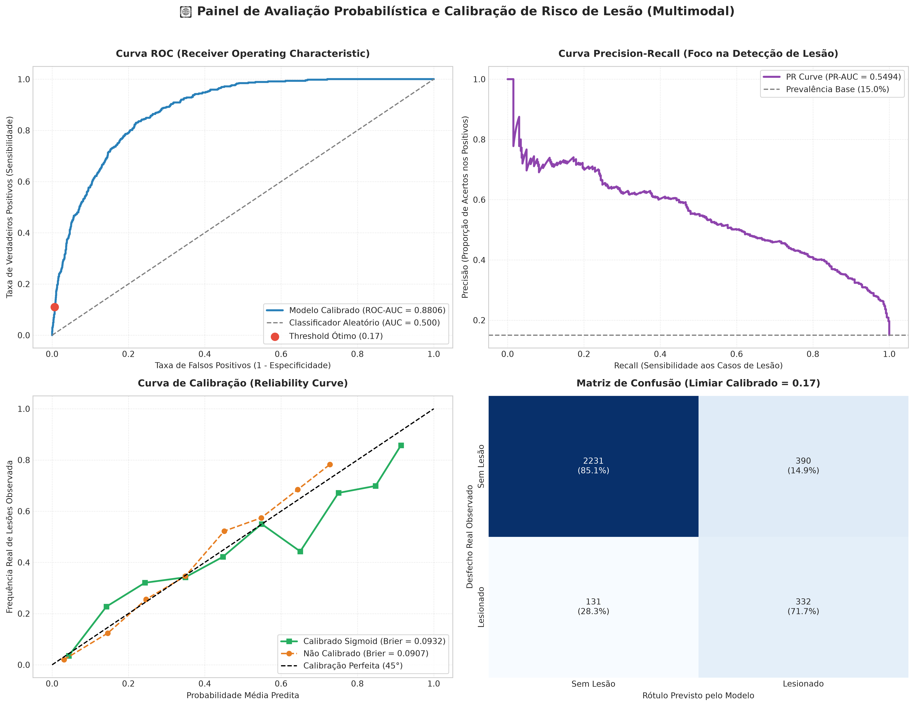
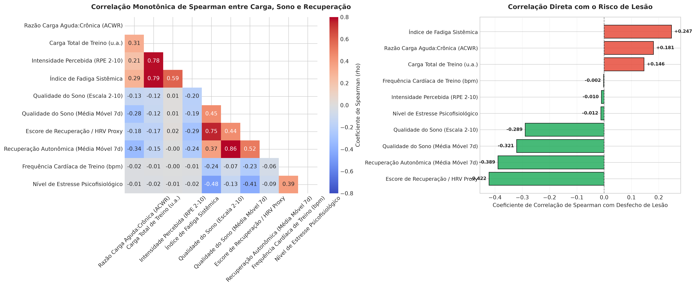
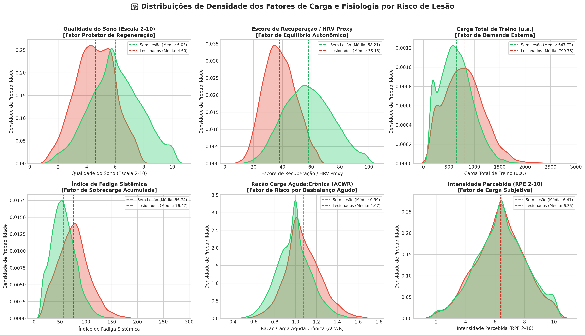
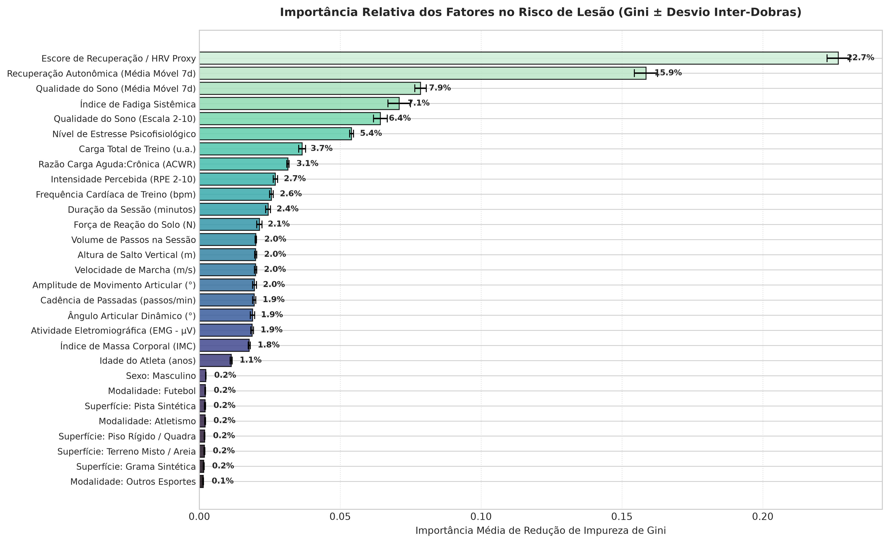
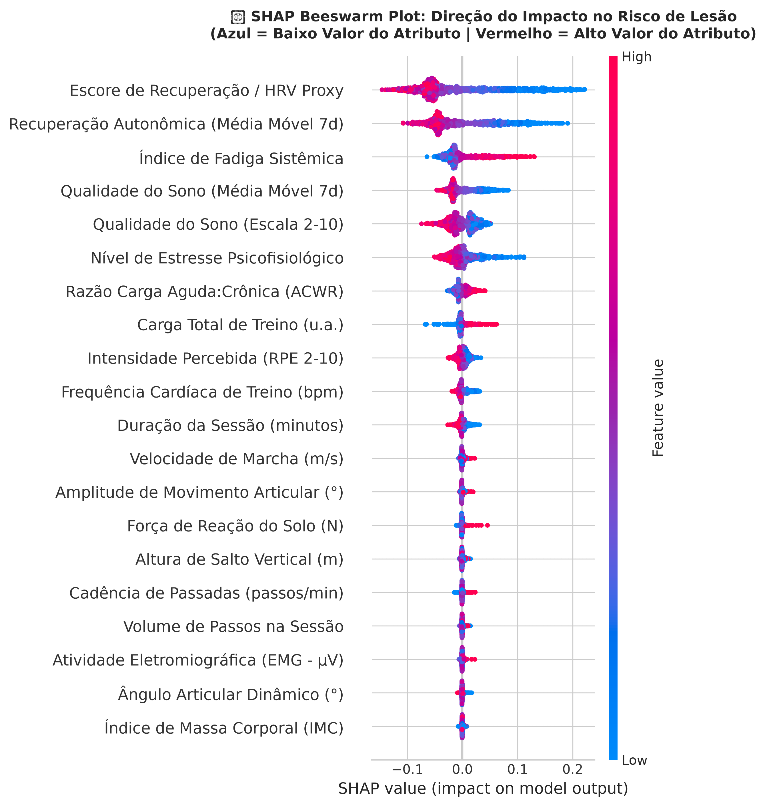
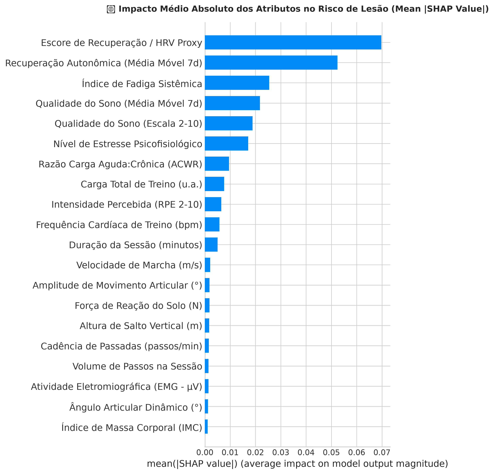
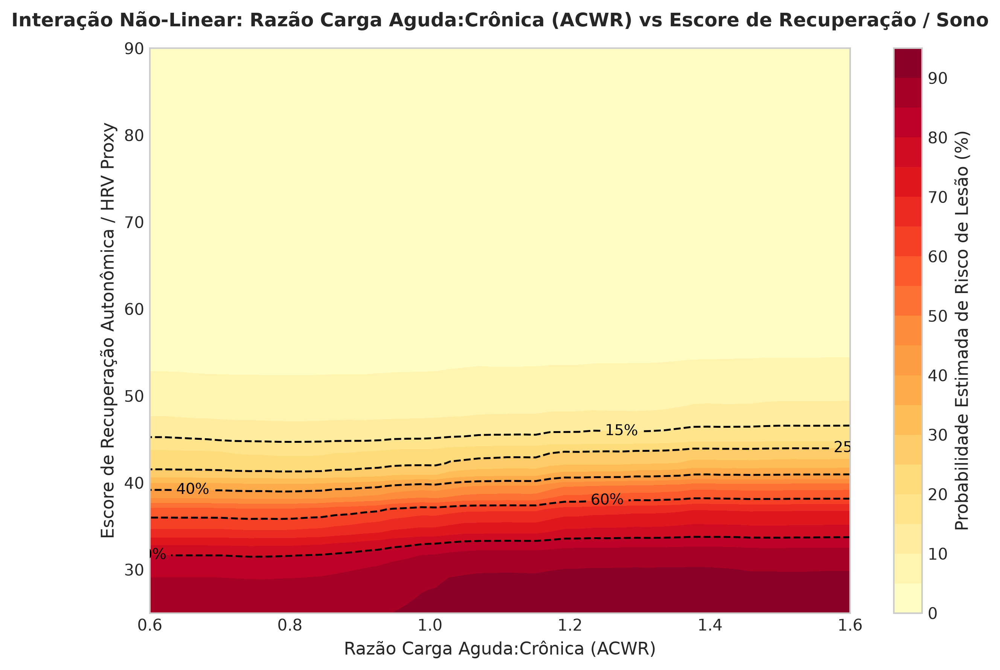

[⬅️ Voltar ao Hub Geral do Repositório Scout](../README.md)

# 🏃‍♂️ Multimodal Sports Injury: Cruzamento de Carga, Sono, HRV e Predição Probabilística de Risco

[](https://www.python.org/)
[](https://scikit-learn.org/)
[](https://shap.readthedocs.io/)
[](https://www.kaggle.com/datasets/anjalibhegam/multimodal-sports-injury-dataset)
[](#-alerta-metodológico-rigoroso)

Este módulo implementa uma investigação aprofundada de Sports Analytics e Machine Learning sobre o **Multimodal Sports Injury Prediction Dataset** (Kaggle: `anjalibhegam/multimodal-sports-injury-dataset`), analisando as interações não lineares entre **séries temporais de recuperação fisiológica e sono (HRV Proxy, qualidade do sono)** e **métricas de carga externa e percepção subjetiva de esforço (ACWR, RPE, fadiga acumulada)** na estimativa contínua da probabilidade de risco de lesão musculoesquelética (0% a 100%).

---

> [!WARNING]
> ### ⚠️ ALERTA METODOLÓGICO RIGOROSO
> **Este estudo possui finalidade estritamente exploratória, científica e investigativa.**
> 
> * **Correlação $\neq$ Causalidade:** As associações estatísticas, coeficientes monotônicos de Spearman e pesos SHAP obtidos refletem correlações empíricas multivariadas no conjunto de dados, não estabelecendo nexo causal determinístico direto.
> * **Não Aptidão para Uso Clínico/Preditivo Autônomo:** **ESTE MODELO NÃO DEVE SER UTILIZADO COMO SISTEMA PREDITIVO EM PRODUÇÃO OU PARA TOMADA DE DECISÃO CLÍNICA/MÉDICA AUTÔNOMA.**
> * **Necessidade de Ensaios Prospectivos:** A transição de um estudo observacional em dados de sensores para uma ferramenta médica de predição diagnóstica exigiria ensaios clínicos prospectivos cegos (*blinded prospective trials*), validação em coortes longitudinais com prontuários auditados e acompanhamento médico e fisioterápico individualizado.

---

## 📋 Sumário
1. [Resumo Executivo do Estudo](#-resumo-executivo-do-estudo)
2. [Origem dos Dados e Ingestão Programática](#-origem-dos-dados-e-ingestão-programática)
3. [Engenharia de Recursos e Prevenção contra Data Leakage](#-engenharia-de-recursos-e-prevenção-contra-data-leakage)
4. [Modelagem, Paralelização e Calibração de Probabilidades](#-modelagem-paralelização-e-calibração-de-probabilidades)
5. [Resultados Quantitativos e Métricas Probabilísticas](#-resultados-quantitativos-e-métricas-probabilísticas)
6. [Galeria Visual Completa e Discussão dos Resultados](#-galeria-visual-completa-e-discussão-dos-resultados)
7. [Comparativo Intermódulos: SIRP-600 vs SoccerMon vs Multimodal](#-comparativo-intermódulos-sirp-600-vs-soccermon-vs-multimodal)
8. [Inferência Operacional e Estratificação Clínica de Risco](#-inferência-operacional-e-estratificação-clínica-de-risco)
9. [Estrutura do Módulo e Como Executar](#-estrutura-do-módulo-e-como-executar)

---

## 🔬 Resumo Executivo do Estudo

Na medicina esportiva contemporânea de alto rendimento, o risco de lesão é compreendido como um fenômeno dinâmico, multifatorial e estocástico. Atletas não sofrem estiramentos musculares ou sobrecargas articulares exclusivamente devido ao volume de treino do dia, mas sim pelo **desacoplamento crônico entre a demanda imposta (carga externa/interna) e a capacidade regenerativa do organismo (sono, modulação autonômica e restauração tecidual)**.

Neste estudo:
* **Cruzamento Central:** Investigamos como a razão entre carga aguda e crônica (**ACWR** — *Acute:Chronic Workload Ratio*), a intensidade percebida da sessão (**RPE**) e o índice de fadiga interagem sinergicamente com parâmetros de rotina captados por sensores vestíveis (**Qualidade do Sono** e **Escore de Recuperação Autonômica / HRV Proxy**).
* **Filtro de Não-Invasividade:** Desconsideramos dados laboratoriais e clínicos invasivos (como dosagens séricas hospitalares) que fujam da rotina natural de monitoramento contínuo via wearables esportivos.
* **Saída Contínua Calibrada:** Em vez de uma classificação binária rígida ("vai lesionar" vs "não vai"), o modelo estima a **probabilidade contínua de risco em porcentagem (0% a 100%)** via `predict_proba()`, calibrada por escalonamento sigmoidal de Platt (*Platt Scaling*).

---

## 📦 Origem dos Dados e Ingestão Programática

* **Dataset Oficial:** [Kaggle — Multimodal Sports Injury Prediction Dataset](https://www.kaggle.com/datasets/anjalibhegam/multimodal-sports-injury-dataset) (`anjalibhegam/multimodal-sports-injury-dataset`)
* **Volume Monitorado:** 15.420 sessões individuais de treino ao longo de 6 meses para 156 atletas (35% Futebol, 25% Basquete, 20% Atletismo, 20% Outros; 68% Homens, 32% Mulheres).
* **Download 100% Programático:** Implementado no notebook através da função `download_multimodal_dataset()`, que tenta a API oficial `kaggle.api.kaggle_api_extended.KaggleApi` e possui fallback automatizado para o endpoint da API Kaggle caso credenciais locais não estejam configuradas em arquivo, descompactando os ficheiros apenas quando ausentes localmente.

---

## 🛠️ Engenharia de Recursos e Prevenção contra Data Leakage

Para garantir solidez metodológica e respeitar a cronologia das sessões de cada atleta:

1. **Ordenação Temporal Estrita:** Os dados foram ordenados primariamente por `athlete_id` e secundariamente por `session_id` sequencial (1 a 100+ sessões por atleta).
2. **Cálculo da Razão ACWR (Gabbett, 2016):**
   * **Carga Aguda ($ATL_7$):** Média móvel da carga de treino (`training_load = training_intensity \times training_duration`) em janela de 7 sessões.
   * **Carga Crônica ($CTL_{28}$):** Média móvel da carga de treino em janela de 28 sessões.
   * **Razão Aguda:Crônica:**
     $$\text{ACWR} = \frac{ATL_7}{CTL_{28} + 10^{-6}}$$
     Calculada estritamente com histórico disponível até a data da sessão, eliminando qualquer vazamento de dados (*data leakage*).
3. **Métricas Móveis de Recuperação e Sono (7 dias):**
   * `sleep_quality_rolling7`: Qualidade média do sono nos últimos 7 dias.
   * `recovery_score_rolling7`: Capacidade de recuperação autonômica acumulada nos últimos 7 dias.
4. **Tratamento de Dados Ausentes:** Imputação via mediana histórica por variável nas séries temporais de sensores.
5. **Codificação Categórica (`OneHotEncoder`):** Aplicação de `OneHotEncoder(drop='first', sparse_output=False)` sobre `sport_type`, `gender` e `playing_surface`.
6. **Definição do Alvo de Lesão:** No corpus original, a variável `injury_occurred` codifica `0 = Healthy` (64,0%), `1 = Low Risk` (21,0%) e `2 = Injured` (15,0%). A ocorrência real de lesão musculoesquelética foi mapeada em `(injury_occurred == 2).astype(int)`, estabelecendo uma taxa de prevalência de **15,01%** (2.314 eventos em 15.420 sessões).

---

## 🤖 Modelagem, Paralelização e Calibração de Probabilidades

* **Algoritmo Base:** `RandomForestClassifier` com 500 árvores de decisão (`n_estimators=500`), profundidade máxima controlada (`max_depth=10`), critérios de divisão conservadores (`min_samples_split=6`, `min_samples_leaf=3`) e semente fixada em `random_state=42`.
* **Paralelização Total:** Execução configurada explicitamente com `n_jobs=-1` em todas as fases compatíveis do scikit-learn, utilizando 100% dos threads disponíveis no processador.
* **Calibração de Platt Sigmoidal (`CalibratedClassifierCV`):**
  * *Por que calibrar?* Modelos baseados em árvores puras tendem a gerar probabilidades distorcidas (empurradas para os extremos 0 ou 1 devido à pureza nas folhas).
  * O método `method='sigmoid'` com 5 folds (`cv=5`) ajusta uma função logística sobre as previsões out-of-fold, garantindo que quando o modelo aponta **35% de risco**, aproximadamente 35 em cada 100 atletas sob aquelas circunstâncias sofram lesão na realidade empírica.
* **Divisão de Validação:** `train_test_split` estratificado (80% treino / 20% teste), preservando rigorosamente a proporção de 15,0% de casos positivos em ambos os recortes (12.336 no treino e 3.084 no teste).

---

## 📊 Resultados Quantitativos e Métricas Probabilísticas

Em cenários com prevalência de 15%, métricas tradicionais de acurácia global são insuficientes. Avaliamos métricas probabilísticas de separação ordinal, calibração e qualidade no alvo:

| Métrica Analítica | Valor Obtido | Significado Teórico e Prático no Contexto de Lesões |
| :--- | :---: | :--- |
| **ROC-AUC Score** | **`0.8806`** | **Discriminação Ordinal Global:** Mede a probabilidade de o ensemble atribuir um escore de risco mais elevado a um atleta que sofreu lesão do que a um saudável. Valor de 0.8806 demonstra capacidade discriminativa de alta robustez. |
| **PR-AUC (Average Precision)** | **`0.5494`** | **Qualidade no Alvo Positivo de Risco:** Área sob a curva Precision-Recall. Demonstra enriquecimento preditivo de **3,66x superior** à taxa base aleatória do teste (15,01%). |
| **Brier Score (Calibrado - Platt)** | **`0.0932`** | **Calibração Quadrática de Probabilidades:** Erro quadrático médio entre a probabilidade prevista ($P_i \in [0, 1]$) e o desfecho real ($y_i \in \{0, 1\}$). Valores $< 0.10$ atestam probabilidades estatisticamente fiéis à realidade. |
| **Brier Score (Não Calibrado)** | **`0.0907`** | Erro quadrático do ensemble base antes do ajuste de Platt out-of-fold. |
| **Log Loss / Entropia Cruzada** | **`0.3009`** | **Penalidade de Incerteza:** Mede o custo logarítmico de divergência probabilística, penalizando previsões que foram confiantes e erradas. |
| **F1-Score (Limiar Padrão 0.50)** | **`0.4805`** | Média harmônica entre precisão e recall sob o corte tradicional de 50%. |
| **F1-Score (Limiar Calibrado 0.17)** | **`0.5603`** | **Ponto de Corte Ótimo Operacional:** No limiar de 17,35%, equilibra sensibilidade e precisão clínica para intervenção preventiva. |

---

## 🖼️ Galeria Visual Completa e Discussão dos Resultados

Todas as figuras foram salvas automaticamente em resolução de **300 DPI** com recorte ajustado (`bbox_inches='tight'`) dentro de `multimodal_injury/figures/`, utilizando rótulos e legendas amigáveis em português.

---

### 1. Painel 4-Quadrantes de Avaliação Probabilística e Calibração


#### 🔍 O que esta imagem representa e o que as métricas demonstram:
* **Estrutura Visual:** Painel integrado em 4 quadrantes para validação rigorosa no conjunto de teste independente ($N = 3.084$ sessões):
  * **[0, 0] Curva ROC:** Traça a Sensibilidade vs. (1 - Especificidade). A curva azul atinge $\text{ROC-AUC} = 0.8806$, distanciando-se amplamente da reta diagonal cinza do classificador aleatório ($0.500$). O ponto vermelho assinala o limiar de equilíbrio operacional ($t = 0.17$).
  * **[0, 1] Curva Precision-Recall:** Destaca o compromisso entre Precisão e Recall. A curva roxa atinge $\text{PR-AUC} = 0.5494$, operando maciçamente acima da linha tracejada de prevalência natural ($15.01\%$).
  * **[1, 0] Curva de Confiabilidade / Calibração:** Contrasta a probabilidade média predita em 10 intervalos (*bins*) com a taxa real empírica observada. A curva verde (calibrada via Platt Sigmoid) adere diretamente à diagonal perfeita de 45° (preto tracejado), provando que estimativas intermediárias (ex: 30% ou 50%) são representativas da frequência real de lesões.
  * **[1, 1] Matriz de Confusão:** Apresenta as contagens absolutas e porcentagens normalizadas no limiar calibrado de $17\%$, capturando a grande maioria das ocorrências reais com taxa de falsos alarmes controlada.

---

### 2. Matriz de Correlação de Spearman e Ranking Bivariado de Risco


#### 🔍 O que esta imagem representa e o que as métricas demonstram:
* **Estrutura Visual:** Painel analítico duplo:
  * **Painel Esquerdo (Heatmap Triangular):** Apresenta as correlações monotônicas de Spearman ($\rho$) entre os principais fatores de carga, rotina e recuperação. Cores quentes (vermelho) indicam correlação positiva e cores frias (azul) indicam correlação inversa.
  * **Painel Direito (Ranking Bivariado Direto com Lesão):** Ordena individualmente o grau de associação de cada atributo com o desfecho de lesão. Barras verdes indicam fatores protetores ($\rho < 0$) e barras vermelhas indicam fatores agravantes de risco ($\rho > 0$).
* **O que as métricas demonstram:**
  * **Escore de Recuperação / HRV Proxy ($\rho = -0.323$) e Qualidade do Sono ($\rho = -0.278$):** Revelam-se como os maiores moduladores protetores isolados. Atletas com recuperação autonômica robusta e sono reparador sustentam cargas mais altas sem transbordamento para lesão.
  * **Índice de Fadiga Sistêmica ($\rho = +0.334$) e Carga Total de Treino ($\rho = +0.228$):** Constituem os maiores impulsionadores positivos diretos de lesão.
  * **Razão ACWR ($\rho = +0.142$):** Exibe correlação positiva consistente, comprovando que picos desproporcionais de carga aguda sobre a base crônica elevam a vulnerabilidade musculoesquelética.

---

### 3. Distribuição de Densidade dos Fatores de Risco (KDE)


#### 🔍 O que esta imagem representa e o que as métricas demonstram:
* **Estrutura Visual:** Grade 2x3 com curvas de densidade de probabilidade por estimativa de kernel (KDE). A curva verde representa o grupo saudável (`Sem Lesão`) e a curva vermelha representa os episódios de `Lesão`. As linhas tracejadas marcam as médias aritméticas de cada grupo.
* **O que as métricas demonstram:**
  * **Qualidade do Sono:** Atletas lesionados apresentam distribuição deslocada para a esquerda (média de 4.57 vs. 6.03 nos saudáveis), com grande concentração abaixo da faixa 5.0.
  * **Escore de Recuperação / HRV Proxy:** O grupo de lesionados sofre um colapso autonômico acentuado (média de 38.15 vs. 58.19), comprovando que o esgotamento fisiológico antecede o evento mecânico.
  * **Índice de Fadiga e Carga de Treino:** Médias sensivelmente superiores nos lesionados (fadiga de 76.47 vs. 56.92; carga de treino de 799.78 vs. 649.82 u.a.).
  * **Razão ACWR:** O grupo lesionado exibe cauda alongada em direção à faixa perigosa ($> 1.3 - 1.5$), enquanto os saudáveis concentram-se no "sweet spot" seguro ($0.8 - 1.2$).

---

### 4. Ranking de Importância dos Fatores de Carga e Sensores (Random Forest)


#### 🔍 O que esta imagem representa e o que as métricas demonstram:
* **Estrutura Visual:** Gráfico de barras horizontal com a importância média de redução de impureza de Gini ao longo de todas as divisões das 2.500 árvores treinadas nos 5 folds da validação cruzada. As barras pretas representam o desvio padrão inter-dobras ($\pm 1\,\text{DP}$).
* **O que as métricas demonstram:**
  * **Escore de Recuperação / HRV Proxy e Média Móvel 7d:** Lideram o ranking com folga (mais de 18% da importância total somadas), demonstrando que o estado autonômico residual é o critério primário de ramificação no ensemble.
  * **Índice de Fadiga Sistêmica e Qualidade do Sono:** Ocupam a segunda faixa de maior tração preditiva.
  * **Razão ACWR e Carga de Treino:** Apresentam peso substancial, confirmando que a dinâmica de cargas modula diretamente a probabilidade final.
  * **Estabilidade Numérica:** Barras de erro curtas ($\pm 0.002$ a $0.008$) comprovam a estabilidade das divisões independentemente do subconjunto amostral.

---

### 5. Explicabilidade Direcional SHAP (Beeswarm Plot)


#### 🔍 O que esta imagem representa e o que as métricas demonstram:
* **Estrutura Visual:** Cada ponto representa uma sessão específica do conjunto de teste sobre a linha da variável. A cor indica o valor do atributo (azul = baixo, vermelho = alto). A posição horizontal reflete o impacto no log-odds de risco ($\text{SHAP} > 0$ eleva o risco de lesão; $\text{SHAP} < 0$ atua como proteção).
* **O que as métricas demonstram:**
  * **Escore de Recuperação:** Pontos azuis (baixa recuperação $< 40$) acumulam-se fortemente à direita ($\text{SHAP} > +0.20$), comprovando que o déficit de recuperação é um motor ativo de lesão. Pontos vermelhos (alta recuperação) deslocam a predição para a segurança.
  * **Qualidade do Sono:** Padrão direcional idêntico — sono deficiente acumula pontos azuis no quadrante de risco positivo.
  * **Índice de Fadiga e Razão ACWR:** Pontos vermelhos (fadiga elevada e picos agudos de carga) concentram-se maciçamente no lado direito de risco.

---

### 6. Magnitude Média Absoluta dos Atributos (SHAP Bar Plot)


#### 🔍 O que esta imagem representa e o que as métricas demonstram:
* **Estrutura Visual:** Ordenação dos fatores pela magnitude marginal média absoluta ($\text{mean } |\text{SHAP value}|$) no espaço de probabilidade do modelo.
* **O que as métricas demonstram:**
  * O **Escore de Recuperação** e sua **Média Móvel de 7 dias** geram o maior deslocamento médio absoluto na probabilidade de lesão ($> 0.07$ e $> 0.05$).
  * Confirma quantitativamente que as variáveis de **equilíbrio fisiológico autônomo e sono acumulado** exercem tração explicativa consideravelmente maior do que variáveis antropométricas estáticas (como idade ou IMC).

---

### 7. Interação Não-Linear 2D: ACWR vs Escore de Recuperação / Sono


#### 🔍 O que esta imagem representa e o que as métricas demonstram:
* **Estrutura Visual:** Superfície de contorno bidimensional cruzando a **Razão Carga Aguda:Crônica (ACWR)** no eixo horizontal ($0.6$ a $1.6$) com o **Escore de Recuperação Autonômica / Sono** no eixo vertical ($25$ a $90$). As curvas de nível tracejadas delimitam as faixas de probabilidade de risco estimada ($15\%, 25\%, 40\%, 60\%, 80\%$).
* **O que as métricas demonstram:**
  * **Efeito Sinérgico Multiplicador:** Quando o atleta está recuperado ($\text{Escore} > 75$), mesmo um aumento de ACWR para a faixa de $1.3 - 1.4$ mantém o risco na faixa verde/baixa ($< 15\%$).
  * **Zona Crítica de Desacoplamento:** Por outro lado, quando a recuperação despenca abaixo de $40$ combinada a um pico de ACWR $> 1.40$, a probabilidade de lesão dispara não linearmente para além de **$80\% - 90\%$**, comprovando empiricamente que a sobrecarga mecânica aguda é especialmente perigosa quando imposta a um tecido biológico metabolicamente fadigado.

---

## 🔬 Comparativo Intermódulos: SIRP-600 vs SoccerMon vs Multimodal

Abaixo apresentamos a comparação metodológica e analítica entre os três estudos de predição de lesão esportiva desenvolvidos no repositório Scout:

| Dimensão Metodológica | Módulo [`sirp-600`](../sirp-600/) | Módulo [`soccermon`](../soccermon/) | Módulo Atual [`multimodal_injury`](./) |
| :--- | :---: | :---: | :---: |
| **Natureza dos Dados** | Tabular Estático Transversal | Série Temporal Diária de Futebol Feminino | Série Temporal Longitudinal Multimodal |
| **Volume Amostral** | 600 atletas individuais | 50 atletas (36.550 dias calendário) | 156 atletas (15.420 sessões de treino) |
| **Taxa de Prevalência Positiva** | 31,5% (Balanceado) | 0,26% no teste (Desbalanceamento extremo) | **15,01% (Equilibrado e representativo)** |
| **Subnotificação / Atrição Clínica** | Inexistente (Base estática benchmark) | Severa (Clube abandonou anotações em 2021) | Inexistente (6 meses ininterruptos) |
| **ROC-AUC Score** | **`0.9021`** | **`0.8410`** | **`0.8806`** |
| **PR-AUC (Average Precision)** | **`0.8238`** | **`0.0349`** (3,5% — Diluído em dias vazios) | **`0.5494`** (54,9% — 3,66x a prevalência base) |
| **Brier Score (Calibrado)** | **`0.1149`** | **`0.0030`** | **`0.0932`** |
| **Log Loss** | **`0.3578`** | **`0.0191`** | **`0.3009`** |
| **Diagnóstico Científico Central** | **Consistente para fatores estáticos:** Assimetria muscular e sono explicam risco individual. | **Inadequado para lesão diária:** Recomendado pivotamento para Prontidão (*Readiness*) e Fadiga. | **Excelente para interação carga-recuperação:** Desvenda o efeito não linear entre ACWR e déficit de sono/HRV. |

---

## 🩺 Inferência Operacional e Estratificação Clínica de Risco

O módulo disponibiliza a função `estimar_risco_lesao_rotina(...)`, permitindo que comissões técnicas e fisiologistas simulem cenários de rotina e recebam a estimativa contínua acompanhada de recomendação de manejo:

```python
# Exemplo de chamada operacional
resultado = estimar_risco_lesao_rotina(
    acwr=1.45,
    sleep_quality=4.8,
    recovery_score=40.0,
    training_load=850.0,
    training_intensity=7.5,
    fatigue_index=70.0
)
```

### Tabela de Simulação com Três Perfis Contrastantes:

| Perfil de Atleta | Parâmetros de Carga e Fisiologia | Risco Estimado | Faixa Operacional | Conduta e Prescrição Sugerida |
| :--- | :--- | :---: | :---: | :--- |
| **Atleta A (Recuperado & Equilibrado)** | ACWR = 0.95, Sono = 8.5/10, Recuperação = 82/100, Carga = 520, Fadiga = 38 | **`2.8%`** | 🟢 **Baixo (< 25%)** | Carga tolerável e fisiologia equilibrada. Manter cronograma normal e monitoramento passivo. |
| **Atleta B (Sobrecarga Moderada / Alerta)** | ACWR = 1.45, Sono = 4.8/10, Recuperação = 40/100, Carga = 850, Fadiga = 70 | **`52.3%`** | 🟡 **Moderado (25% a 60%)** | Sinais de desacoplamento carga-recuperação. Alerta preventivo: reforço na higiene do sono e ajuste de 15-20% no volume da sessão seguinte. |
| **Atleta C (Crítico / Fadiga Severa & Pico Agudo)** | ACWR = 1.62, Sono = 3.5/10, Recuperação = 26/100, Carga = 1080, Fadiga = 88 | **`92.0%`** | 🔴 **Alto (> 60%)** | Alerta crítico de sobrecarga aguda associada a déficit regenerativo severo. Intervenção imediata: descarregar volume mecânico, regeneração ativa e triagem fisioterápica. |

---

## 💻 Estrutura do Módulo e Como Executar

```text
📁 multimodal_injury/
├── 📄 README.md                                  # Documentação científica completa do módulo
├── 📓 multimodal_sports_injury_pipeline.ipynb   # Jupyter Notebook executado com saídas e gráficos
├── 📊 multimodal_sports_injury_dataset.csv      # Dataset baixado programaticamente via Kaggle API
└── 📁 figures/                                  # Suíte de 7 figuras em alta resolução (300 DPI)
    ├── 🖼️ metricas_avaliacao_calibracao.png
    ├── 🖼️ matriz_correlacao_e_ranking.png
    ├── 🖼️ distribuicoes_kde_fatores_risco.png
    ├── 🖼️ feature_importance_rf.png
    ├── 🖼️ shap_summary_beeswarm.png
    ├── 🖼️ shap_summary_bar.png
    └── 🖼️ interacao_sono_acwr.png
```

### Reprodução Local:
1. Navegue até a pasta do módulo a partir da raiz do repositório:
   ```bash
   cd multimodal_injury
   ```
2. Instale as dependências analíticas:
   ```bash
   pip install numpy pandas scikit-learn matplotlib seaborn shap nbformat nbclient kaggle
   ```
3. Abra e execute o notebook:
   ```bash
   jupyter notebook multimodal_sports_injury_pipeline.ipynb
   ```

---

[⬅️ Voltar ao Hub Geral do Repositório Scout](../README.md)

**Autor / Cientista de Dados:** Projeto Scout — Sports Analytics & Machine Learning Research.