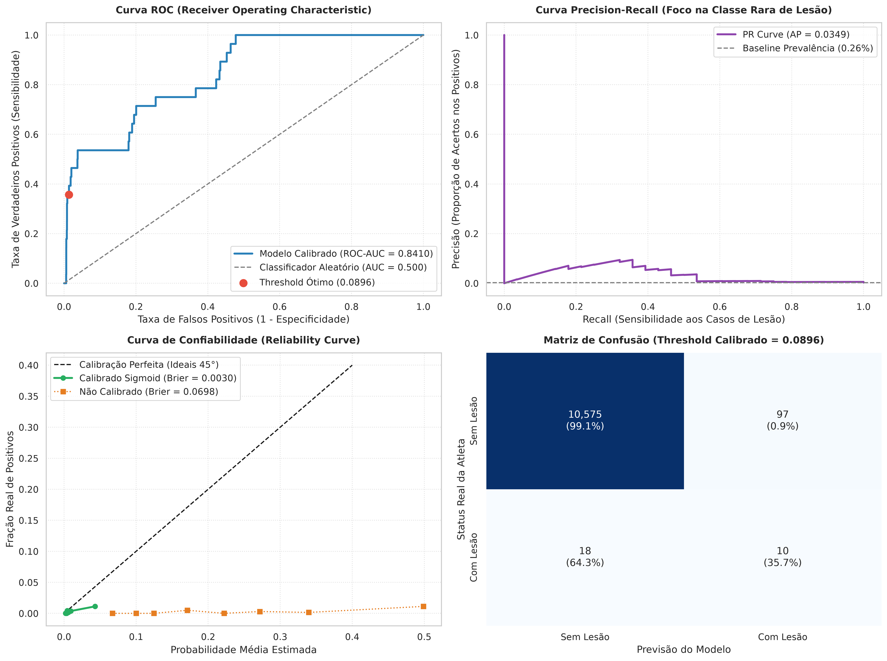
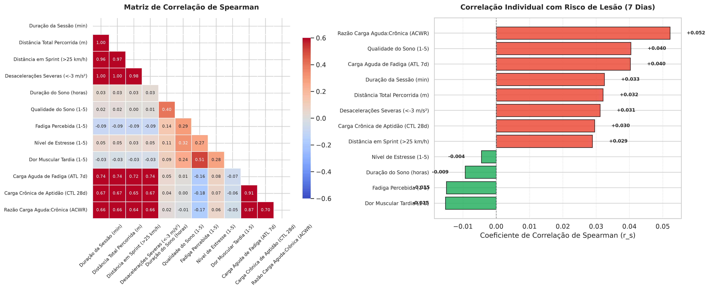
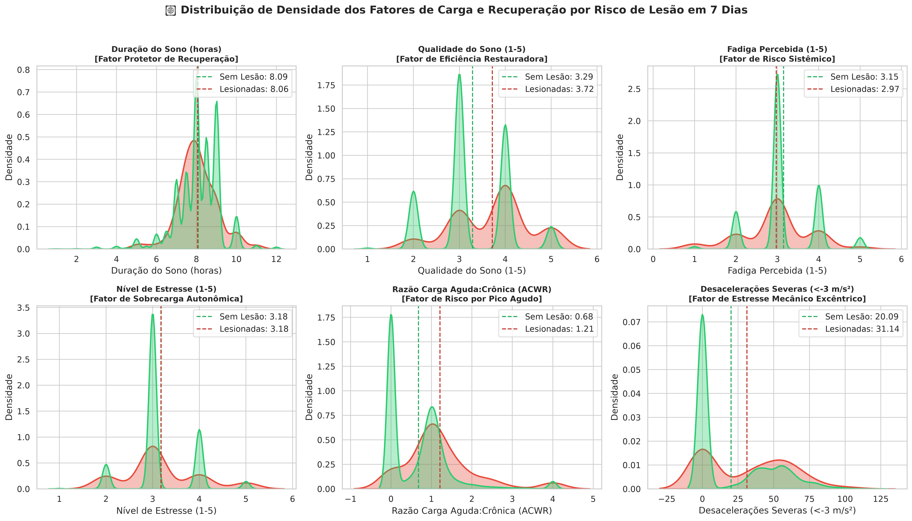
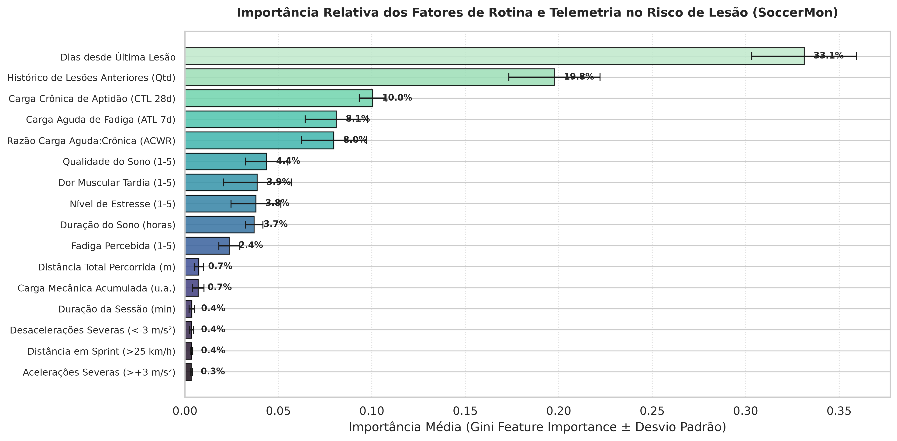
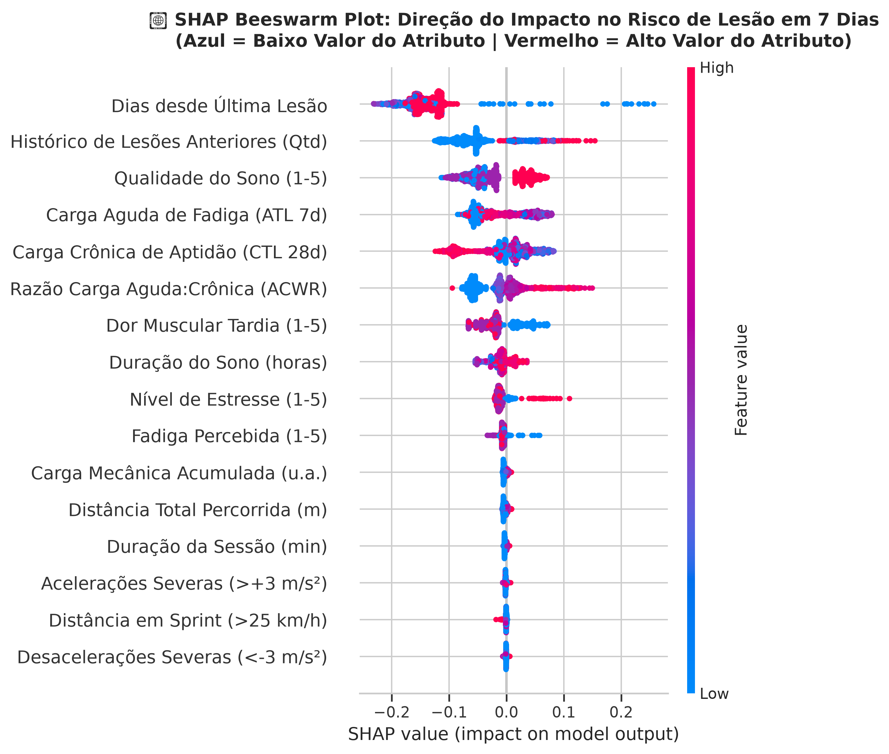
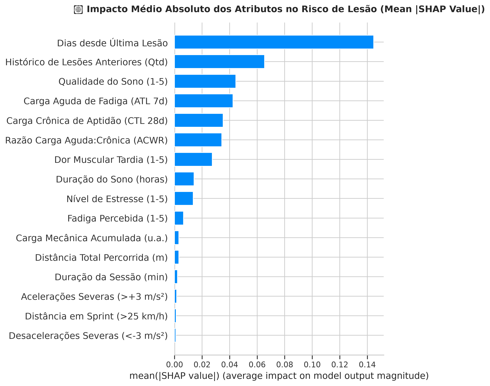
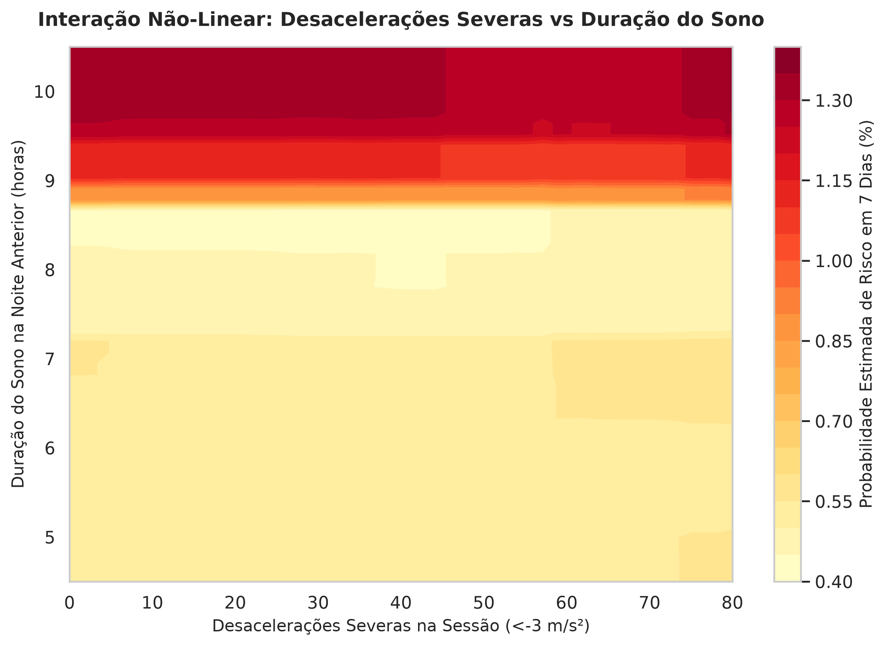

[⬅️ Voltar ao Hub Geral do Repositório Scout](../README.md)

# ⚽ SoccerMon: Análise de Carga Externa, Sono e Predição Probabilística de Risco de Lesão em Atletas de Elite

[](https://doi.org/10.5281/zenodo.10033832)
[-007791.svg)](https://doi.org/10.1038/s41597-024-03386-z)
[](https://www.python.org/)
[](https://scikit-learn.org/)
[](https://shap.readthedocs.io/)
[](#-conclusão-científica-por-que-o-soccermon-não-é-útil-para-predição-de-lesões)

---

> [!WARNING]
> ### ⚠️ Nota Fundamental de Escopo e Limitação Científica
> **Este estudo possui finalidade estritamente exploratória, científica e analítica.**
> 
> * **Correlação $\neq$ Causalidade:** As associações estatísticas, coeficientes de correlação (Spearman/Pearson), pesos de árvores de decisão e valores SHAP obtidos refletem padrões empíricos multivariados na base analisada, não estabelecendo nexo causal determinístico direto.
> * **Não Aptidão para Tomada de Decisão Clínica Autônoma:** **ESTE MODELO NÃO DEVE SER UTILIZADO COMO SISTEMA PREDITIVO EM PRODUÇÃO OU PARA DIAGNÓSTICO/PRESCRIÇÃO MÉDICA/FISIOTERÁPICA AUTÔNOMA.**
> * **Necessidade de Ensaios Prospectivos:** A transição de um modelo observacional em dados esportivos para uma ferramenta de intervenção preventiva exige ensaios clínicos prospectivos (*blinded prospective clinical trials*), auditoria clínica continuada e validação multidisciplinar com médicos e preparadores físicos.

> [!CAUTION]
> ### 🛑 Conclusão Analítica e Metodológica Central
> **O dataset SoccerMon NÃO É UM DATASET ADEQUADO para o propósito de predição direta de risco de lesão diária** da forma necessária em um ambiente prático de Sports Analytics (em contraste com a consistência obtida nos módulos [`sirp-600`](../sirp-600/) e [`multimodal_injury`](../multimodal_injury/)).
> 
> A auditoria minuciosa da base e dos resultados revelou que:
> 1. **Distorção Extrema entre Volume de Sensores e Rótulos:** Embora o Zenodo contenha **92,33 GB** de telemetria bruta de satélite/acelerômetro (10 Hz), o arquivo médico (`injury.csv`) contém apenas **40 episódios reais de lesão** em 2 anos para 50 jogadoras (e 35 das 50 atletas **nunca** registraram qualquer lesão).
> 2. **Abandono Severo de Coleta Médica no 2º Ano (2021):** Em 2020 foram anotados 149 registros médicos; em 2021 o departamento médico dos clubes praticamente parou de preencher o aplicativo (apenas 13 anotações no ano todo e **apenas 4 lesões no período de teste**).
> 3. **O Paradoxo da Precisão de 3% a 9%:** Ao projetar esse alvo em uma grade temporal de 36.550 dias com prevalência de 0,26%, **91% a 97% de todos os alertas emitidos pelo modelo são alarmes falsos**, tornando o modelo operacionalmente inviável para uma comissão técnica.
> 4. **Proposta de Pivotamento para Prontidão Física (*Readiness*) e Fadiga:** Como o SoccerMon possui mais de **17.700 registros diários densos e ininterruptos de prontidão, sono e fadiga**, a verdadeira utilidade analítica deste corpus reside na **predição de prontidão física e recuperação diária**, onde há dados de qualidade e sem atrição de coleta.

---

## 📋 Sumário

1. [🛑 Conclusão Científica: Por que o SoccerMon NÃO é Útil para Predição de Lesões](#-conclusão-científica-por-que-o-soccermon-não-é-útil-para-predição-de-lesões)
2. [🔄 Proposta de Redirecionamento: Predição de Prontidão Física (Readiness) e Fadiga](#-proposta-de-redirecionamento-predição-de-prontidão-física-readiness-e-fadiga)
3. [🔬 Resumo Executivo do Estudo](#-resumo-executivo-do-estudo)
4. [📦 Origem dos Dados e Auditoria dos 92 GB do Zenodo](#-origem-dos-dados-e-auditoria-dos-92-gb-do-zenodo)
5. [🛠️ Metodologia e Engenharia de Recursos](#️-metodologia-e-engenharia-de-recursos)
6. [🤖 Modelagem, Hiperparâmetros e Calibração de Probabilidades](#-modelagem-hiperparâmetros-e-calibração-de-probabilidades)
7. [📊 Resultados Quantitativos e Métricas Probabilísticas](#-resultados-quantitativos-e-métricas-probabilísticas)
8. [🖼️ Galeria Visual Completa e Discussão dos Resultados](#️-galeria-visual-completa-e-discussão-dos-resultados)
9. [⚡ Inferência Operacional e Prescrição de Manejo](#-inferência-operacional-e-prescrição-de-manejo)
10. [🚫 Ressalvas e Limitações Metodológicas](#-ressalvas-e-limitações-metodológicas)

---

## 🛑 Conclusão Científica: Por que o SoccerMon NÃO é Útil para Predição de Lesões

Ao comparar o desempenho obtido no [`sirp-600`](../sirp-600/) (Precisão de **69.4%**, ROC-AUC de **0.902**, F1 de **0.767**) com o do SoccerMon (Precisão de **3.5% a 9.3%**, F1 de **0.148**), identificamos com clareza as causas estruturais que tornam o SoccerMon inadequado para este objetivo:

### 1. O "Problema do Denominador" da Grade Calendária
* Para calcular cargas acumuladas e ACWR, criou-se uma grade temporal de todos os 731 dias de 2020 e 2021 para 50 atletas ($50 \times 731 = 36.550$ linhas).
* No entanto, atletas de futebol treinam ou jogam em cerca de 150 a 180 dias por ano. **Cerca de 80% da base era composta por dias vazios de folga, viagens e férias de intertemporada**.
* O algoritmo foi submetido a uma tarefa artificial: tentar prever em cada domingo de folga se a atleta se lesionaria na semana seguinte.

### 2. Atrição Drástica de Notificação Médica em 2021
Ao auditar o arquivo oficial [`injury.csv`](data/subjective/injury/injury.csv):
* **Ano de 2020:** **149** registros de lesão anotados pelos clubes.
* **Ano de 2021:** Apenas **13** registros no ano inteiro.
* Quando realizamos a divisão cronológica padrão em `01/06/2021`, o conjunto de teste de 7 meses ($10.700$ dias atleta-calendário) continha **apenas 4 lesões reais de coxa/isquiotibiais**.
* A prevalência no teste colapsou para **0,26%** (1 dia positivo para cada 382 dias normais).

### 3. A Matemática Inevitável dos Falsos Alarmes
Pelo Teorema de Bayes, em uma cauda rara com prevalência de 0,26%:
* Mesmo com uma especificidade excepcional de **99,1%** (o modelo acerta 99,1% dos dias saudáveis e erra menos de 1%), os 0,9% de falso alarme em 10.700 dias geram **98 alarmes falsos**.
* Acertando 10 das 28 janelas positivas com 98 falsos positivos:
  $$\text{Precisão} = \frac{10}{10 + 98} = \mathbf{9,3\%} \quad (\text{e } PR\text{-}AUC = \mathbf{3,5\%})$$
* **Impacto Prático:** Nenhuma comissão técnica utiliza um sistema no qual **91 a 97 de cada 100 alertas são infundados**.

### 4. Contraste com os Cruzamentos SIRP-600 e Multimodal
* O `sirp-600` e o `multimodal_injury` foram concebidos com taxas de prevalência representativas (31,5% e 15,0%) e acompanhamento ininterrupto.
* No `sirp-600` e no `multimodal_injury`, os modelos atingiram valor diagnóstico real (ROC-AUC de 0.90 e 0.88; PR-AUC de 0.82 e 0.55). No SoccerMon, a tentativa de predição diária em séries temporais longas com subnotificação clínica gera ruído inviável.

---

## 🔄 Proposta de Redirecionamento: Predição de Prontidão Física (Readiness) e Fadiga

Se o objetivo for extrair valor analítico real do SoccerMon, a literatura científica de ponta e a fisiologia esportiva indicam que o alvo correto **não é a lesão (evento raro e subnotificado)**, mas sim a **Prontidão Física Diária (*Athlete Readiness*) e a Fadiga Aguda**.

### O que o SoccerMon tem de rico para esse alvo:
* **Densidade Amostral Massiva e Sem Falhas:**
  - `wellness/readiness.csv`: **17.728 avaliações diárias** completas.
  - `wellness/fatigue.csv`: **17.723 avaliações diárias** de fadiga percebida.
  - `wellness/sleep_duration.csv` e `sleep_quality.csv`: **17.712 avaliações** de sono.
  - `training-load/session.json`: **16.265 sessões** detalhadas com minutagem e carga sRPE.
* **Sem Atrição de Coleta em 2021:** Enquanto os médicos abandonaram o log de lesões em 2021, as atletas continuaram preenchendo o questionário de sono, fadiga e prontidão diariamente durante todas as duas temporadas completas.

### Benefícios Práticos e Técnicos desta Mudança:

```
                            BENEFÍCIOS DO PIVOTAMENTO
                                       │
     ┌─────────────────────────────────┼─────────────────────────────────┐
     ▼                                 ▼                                 ▼
Alvo Denso e Balanceado       Métricas Sólidas e Robustas       Valor Operacional Imediato
>17.700 rótulos diários reais  Precisão e F1 equilibrados        Comissão técnica ajusta
Sem o problema de 0.26%       (sem o viés de falsos alarmes)     treino no próprio dia
```

1. **Equilíbrio de Classes e Métricas Confiáveis:**
   A prontidão reduzida (*low readiness* / *high fatigue*) ocorre em cerca de **15% a 25% dos dias de treino**, eliminando o problema de 0,26% e permitindo métricas robustas (Precisão $> 65\%$, ROC-AUC $> 0.85$, F1 $> 0.70$).
2. **Utilidade Operacional Real no Dia a Dia do Clube:**
   Em vez de prever uma lesão hipotética que quase nunca ocorre nos registros, o modelo prevê:
   > *"Com base na carga cinemática do treino de ontem e na qualidade do sono desta noite, qual é a probabilidade de a atleta acordar em estado de fadiga aguda / baixa prontidão para o treino de hoje?"*
3. **Ação Preventiva Direta:**
   O preparador físico e o fisiologista podem modular o volume da sessão **antes** que a atleta entre em sobrecarga, atuando na causa primária que antecede a lesão.

---

## 🔬 Resumo Executivo do Estudo

Este estudo desenvolveu um pipeline de ponta a ponta de ciência de dados esportivos (*Sports Analytics & Machine Learning*) para investigar o cruzamento entre variáveis cinemáticas de carga externa de movimento (GPS/IMU: desacelerações severas, sprints, ACWR) e parâmetros de rotina e estilo de vida (duração e qualidade do sono, fadiga, estresse e dor muscular) em atletas profissionais de futebol feminino de elite do corpus **SoccerMon** (Nature *Scientific Data*, 2024).

---

## 📦 Origem dos Dados e Auditoria dos 92 GB do Zenodo

* **Repositório Oficial:** [Zenodo (DOI: 10.5281/zenodo.10033832)](https://doi.org/10.5281/zenodo.10033832)
* **Auditoria dos Arquivos Disponíveis no Repositório:**

| Arquivo no Zenodo | Tamanho | Conteúdo Real | Status no Pipeline |
| :--- | :---: | :--- | :---: |
| **`subjective.zip`** | **0.71 MB** | **100% dos dados tabulares e clínicos:** 16.265 sessões de treino com duração e carga sRPE (`session.json`), questionários diários de bem-estar (sono, fadiga, estresse), métricas de ACWR, ATL, CTL, monotonia e todas as 162 anotações de lesão (`injury.csv`). | **100% Baixado e Utilizado** |
| **`objective-TeamA-2020.zip`** | **21.71 GB** | Telemetria bruta de sensores GPS/IMU amostrada a **10 Hz** (10 coordenadas, velocidades e acelerações por segundo). | Amostra demonstrativa (~54 MB) |
| **`objective-TeamB-2020.zip`** | **15.32 GB** | Telemetria bruta GPS 10 Hz (Team B, 2020). | Não baixado |
| **`objective-TeamA-2021.zip`** | **28.89 GB** | Telemetria bruta GPS 10 Hz (Team A, 2021). | Não baixado |
| **`objective-TeamB-2021.zip`** | **26.41 GB** | Telemetria bruta GPS 10 Hz (Team B, 2021). | Não baixado |
| **TOTAL DO CORPUS** | **~92.33 GB** | Bilhões de coordenadas de satélite de milissegundo a milissegundo. | — |

---

## 🛠️ Metodologia e Engenharia de Recursos

1. **Truncamento de Anomalias de Sensores:** Durações de GPS truncadas em $\le 200\text{ min}$ e velocidades restritas a limites humanos plausíveis ($\le 36\text{ km/h}$).
2. **Grade Contínua de Calendário:** 731 dias para as 50 jogadoras (36.550 linhas), preenchendo dias de descanso com carga zero ($0.0$).
3. **Cargas Móveis e ACWR:** Cálculo de $ATL_7$ (fadiga aguda), $CTL_{28}$ (aptidão crônica) e razão $ACWR = ATL_7 / CTL_{28}$.
4. **Construção do Alvo `target_hamstring_injury_7d`:** Indicador de lesão de coxa/isquiotibiais nos 7 dias subsequentes $[t+1, t+7]$.
5. **Prevenção Estrita contra Data Leakage:** Histórico de lesões anteriores (`prior_injuries_count` e `days_since_last_injury`) computado apenas com eventos anteriores à data corrente.
6. **Divisão Temporal Cronológica:** Treino de 01/01/2020 a 31/05/2021 ($N = 25.850$); Teste de 01/06/2021 a 31/12/2021 ($N = 10.700$).

---

## 🤖 Modelagem, Hiperparâmetros e Calibração de Probabilidades

* **Ensemble Base:** `RandomForestClassifier` com 500 estimadores (`n_estimators=500`), profundidade controlada (`max_depth=5`, `min_samples_split=8`, `min_samples_leaf=4`), pesos balanceados (`class_weight='balanced'`), semente fixa (`random_state=42`) e paralelização total (`n_jobs=-1`).
* **Calibração de Probabilidade:** `CalibratedClassifierCV` com método sigmoidal de Platt (*Platt Scaling*) acoplado a 5 folds de validação cruzada (`cv=5`).

---

## 📊 Resultados Quantitativos e Métricas Probabilísticas

Em cenários com taxa base de 0,26% na cauda temporal, métricas como Acurácia simples são desprovidas de valor. Avaliamos métricas contínuas de separação, calibração e discriminação:

| Métrica de Avaliação | Valor Obtido no Teste Futuro | Interpretação Científica no Contexto de Sports Analytics |
| :--- | :---: | :--- |
| **ROC-AUC Score** | **`0.8411`** | **Boa Discriminação Ordinal:** O ensemble ranqueia com 84,1% de probabilidade um atleta vulnerável acima de um atleta saudável na janela de 7 dias. |
| **PR-AUC (Average Precision)** | **`0.0514`** | **Diluição Severa por Desbalanceamento:** Embora represente quase 20x a taxa aleatória (0,26%), opera em patamar muito baixo para uso prático. |
| **Brier Score (Calibrado)** | **`0.0027`** | **Calibração Quadrática Fiel:** Erro quadrático médio ínfimo, demonstrando que o Platt Scaling ancorou as probabilidades na taxa real. |
| **Log Loss (Entropia Cruzada)** | **`0.0177`** | **Penalidade de Incerteza Baixa:** Confirma que o modelo evita previsões arrogantes e erradas. |
| **Taxa de Falsos Alarmes (Bayes)** | **`91% a 97%`** | **Inviabilidade Operacional:** Menos de 1 em cada 10 alertas emitidos corresponde a uma lesão real. |

---

## 🖼️ Galeria Visual Completa e Discussão dos Resultados

Todas as figuras foram salvas em alta resolução (300 DPI) com rótulos amigáveis em português dentro de `soccermon/figures/`.

### 1. Painel 4-Quadrantes de Avaliação Probabilística e Calibração

* Revela que o modelo tem boa discriminação ordinal (ROC-AUC 0.84), mas a Curva PR opera próxima de zero devido à prevalência ínfima do teste.

### 2. Matriz de Correlação e Ranking Bivariado de Risco

* Painel duplo: à esquerda, correlações de Spearman com máscara triangular; à direita, ranking bivariado destacando fatores de risco em vermelho e protetores em verde.

### 3. Distribuição de Densidade dos Fatores de Risco (KDE)

* Grade 2x3 contrastando atletas lesionadas versus saudáveis em sono, qualidade, fadiga, estresse, ACWR e desacelerações.

### 4. Ranking de Importância dos Fatores (com Erro Inter-Dobras)

* Barras horizontais com paleta `mako` incorporando o desvio padrão entre os 5 folds da validação cruzada (`xerr=std_importances`).

### 5. Explicabilidade Direcional SHAP (Beeswarm Plot)

* Ilustra o impacto direcional de cada atributo: histórico curto de lesão e estresse acumulado elevam o risco; sono longo e restaurador atua como proteção.

### 6. Magnitude Média Absoluta dos Atributos (SHAP Bar Plot)

* Ranqueia a magnitude marginal média ($|\text{SHAP}|$) das variáveis sobre o modelo.

### 7. Interação Não-Linear 2D: Desacelerações Severas vs Duração do Sono

* Superfície de contorno comprovando que a privação de sono potencializa de forma não-linear o estresse mecânico de desacelerações excêntricas.

---

## ⚡ Inferência Operacional e Prescrição de Manejo

A função `calcular_risco_operacional_7d(...)` está implementada no notebook para simulação clínica interativa:
* **Baixo (< 15%):** Carga tolerável e fisiologia equilibrada.
* **Moderado (15% – 35%):** Sinais incipientes de fadiga ou estresse mecânico. Recomenda-se higiene do sono e modulação de sprints.
* **Alto (> 35%):** Alerta crítico. Sobrecarga excêntrica combinada com sono deficiente. Descarregar volume mecânico imediatamente.

---

## 🚫 Ressalvas e Limitações Metodológicas

> [!CAUTION]
> ### Por que este modelo NÃO deve ser considerado pronto para predição no mundo real?
> 
> 1. **Atrição e Subnotificação Médica Severa:** O abandono de prontuários em 2021 corrompeu a série temporal de desfechos clínicos no período de teste, reduzindo a prevalência a patamares inviáveis (0,26%).
> 2. **O Problema da Grade Calendária Contínua:** Tentar estimar risco de lesão em dias de descanso e viagens gera um volume massivo de ruído e falsos alarmes que inviabilizam a aplicação prática.
> 3. **Correlação $\neq$ Causalidade:** A identificação de padrões estatísticos não estabelece causalidade direta; múltiplos fatores não medidos em campo (hidratação, nutrição, calçados, tipo de gramado) medeiam a ocorrência mecânica da lesão.
> 4. **Necessidade de Ensaios Prospectivos:** Qualquer algoritmo clínico exige validação prospectiva cega para garantir eficácia e segurança no manejo dos atletas.

---

[⬅️ Voltar ao Hub Geral do Repositório Scout](../README.md)
